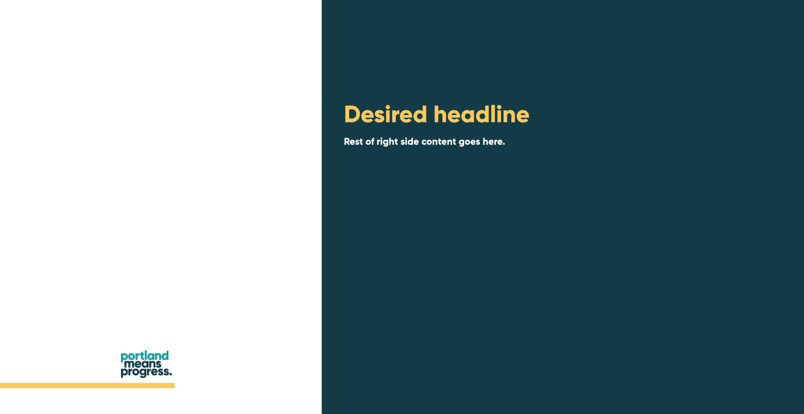

# Portland Means Progress Slide Template


- [Content Overview](#content-overview)
- [Example Slides](#example-slides)
  - [Title slide](#title-slide)
  - [Standard two column layout
    slide](#standard-two-column-layout-slide)
  - [Two column layout with different
    color](#two-column-layout-with-different-color)
  - [Two column layout with headline inside the right
    column](#two-column-layout-with-headline-inside-the-right-column)
  - [Two column layout with quote](#two-column-layout-with-quote)
  - [Callout slide](#callout-slide)
- [Using The `pmp-footer` Shortcode](#using-the-pmp-footer-shortcode)
- [About](#about)

<!-- THIS README IS GENERATED VIA THE QMD-FILE README.QMD. MAKE EDITS THERE. -->

<!-- THIS README IS GENERATED VIA THE QMD-FILE README.QMD. MAKE EDITS THERE. -->

<!-- THIS README IS GENERATED VIA THE QMD-FILE README.QMD. MAKE EDITS THERE. -->

<!-- THIS README IS GENERATED VIA THE QMD-FILE README.QMD. MAKE EDITS THERE. -->

<!-- THIS README IS GENERATED VIA THE QMD-FILE README.QMD. MAKE EDITS THERE. -->

<!-- THIS README IS GENERATED VIA THE QMD-FILE README.QMD. MAKE EDITS THERE. -->

## Content Overview

Example slide decks can be found in `example.qmd` and `template.qmd`.
This template comes with the following SCSS classes (defined in
`theme.scss`):

- `.callout-slide` (like title slide but with customizable title)
- `.theme-two-cols` (background is white on the left and dark teal on
  the right)
- `.custom-grid`, `.left-col` and `.right-col` (helper classes to place
  content properly within the ares of `.theme-two-cols`)
- `.quote-box` (for adding quotes)

Additionally, there are the classes `.yellow`, `.dark-purple`,
`.dark-yellow` and `.light-purple`. These are typically used together
with `theme-two-cols` to colorize the title font and color bar
differently.

Also, if there is no title required inside the left column of
`.theme-two-cols` one can add the `.no-left-heading` to the section as
well. This will likely mean that one wants to have a heading inside the
right column. In that case, inside `.left-col` one should place another
div with the `.right-heading` class.

Finally, there is a shortcode `pmp-footer` that comes with this Quarto
project. This one can be used to add the “PMP badge” and a colored bar
at the bottom of a slide. Typically, this is used in conjunction with
`.theme-two-cols`. See [below](#using-the-pmp-footer-shortcode) for more
information on how to use it and which requirements apply.

## Example Slides

### Title slide

The title slide is goverend by the `title` in the YAML header.


### Standard two column layout slide

``` qmd
## A headline {.theme-two-cols}

:::: {.custom-grid}

::: {.left-col}

This content goes into the left column.
The headline on the left column comes from the headline of this section.

:::


::: {.right-col style="margin-top: -75px;"}

This content goes into the right column.

:::

::::


```


Notice that inside the `.right-col` there’s a custom `margin-top`
styling. This allows the user to manually align the content on the right
with the headline inside the left column. By default, this template uses
a `margin-top: -150px` which works well for headlines that span 2 lines.

### Two column layout with different color

To make the previous slide use a different theme color one can add one
of the `.yellow`, `.dark-purple`, `.dark-yellow` and `.light-purple`
classes.

``` qmd
## A headline {.theme-two-cols .yellow}

:::: {.custom-grid}

::: {.left-col}

This content goes into the left column.
The headline on the left column comes from the headline of this section.

:::


::: {.right-col style="margin-top: -75px;"}

This content goes into the right column.

:::

::::


```


### Two column layout with headline inside the right column

To use a headline inside the right column, one needs to

- leave the left column blank,
- add the `.no-left-heading` class to the section, and
- add the desired headline using a div-container of class
  `.right-heading`.

``` md
## Desired headline {.theme-two-cols .no-left-heading .yellow}

:::: {.custom-grid}

::: {.left-col}

:::


::: {.right-col style="margin-top: 0px;"}

::: {.right-heading}
Desired headline
:::

Rest of right side content goes here.

:::

::::



```



### Two column layout with quote

One can create a slide with a quote by using the `.quote-box` class
inside the `.right-col` of `.theme-two-cols`. The color of the quotation
mark will be inherited from the section. This means that if the slide
uses `.dark-yellow`, then so will the quotation mark.

``` md
## Desired Headline {.theme-two-cols .dark-yellow}

:::: {.custom-grid}

::: {.left-col}

Some text here. 
Or some other content.
The choice is absolutely yours.

:::


::: {.right-col}

::: {.quote-box}
Some deep meaningful quote can be found in there.
:::

:::

::::


```


### Callout slide

A callout slide (like “Thank you” at the end) can be added in one line.
To do so, one needs to combine the classes `.callout-slide` and
`.center`

``` md
## Thank you {.callout-slide .center}
```


## Using The `pmp-footer` Shortcode

This project uses the extension `pmp-footer`. This extension is just a
very simple one. All it offers is the `` shortcode. This footer will
throw the following raw HTML code:

``` html
<div class="two-col-footer">
    <p>
        
    </p>
    <div class="color-bar"></div>
</div>
```

So for the shortcode to work properly, you will need two things:

- The style file `theme.scss` that contains the styling for the classes
  `two-col-footer` and `color-bar`.
- The image file `PMP - Blue.png` located in a directory `assets/imgs/`
  (the `../../../../../` part in the `src` path is just a clunky way to
  navigate out of the directories that RevealJS creates.)

> [!IMPORTANT]
>
> This footer works only properly within `<div>`-containers of the class
> `.theme-two-cols` due to the associated class `.theme-two-col` that is
> defined in there.

## About

This documentation was last rendered

``` r
Sys.time()
## [1] "2025-05-11 15:01:43 CEST"
```
